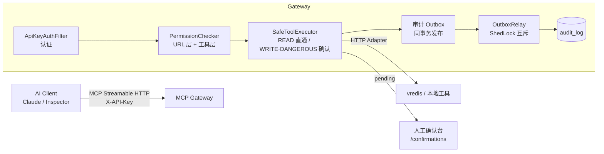
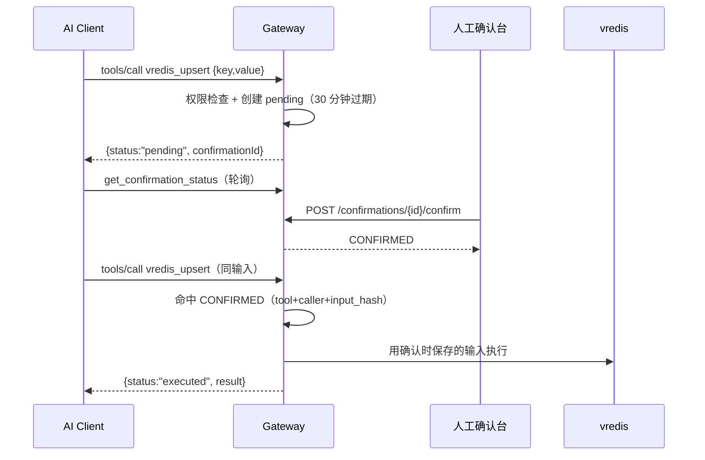

# mcp-tool-gateway — MCP 工具网关与安全沙箱

把 MCP Server 的"裸奔"工具调用变成可控流量。AI 客户端仍然用标准 MCP 协议（Streamable HTTP）
连接网关，但每个工具调用都会经过 **API Key 认证 → 权限矩阵（URL 层 + 工具层）→ 副作用分级
（READ 直通 / WRITE·DANGEROUS 人工确认）→ 事务性审计**四道闸门；审计经 Outbox 异步落库，
与业务同事务提交，保证不丢。

## 架构



## 核心能力

- **权限**：两层模型——URL 层（`/admin/**` 需 admin 角色，`/mcp/**` 需认证）+ 工具层
  （每个工具声明 `requiredRole` / `requiredTenant`，未声明分级的一律拒绝）。
- **人工确认**：WRITE / DANGEROUS 工具首次调用返回 `pending + confirmationId`，
  REST 确认/拒绝（幂等），确认后**同调用方 + 同输入**再调用才真正执行，
  且执行用的是确认时保存的输入快照（防确认后换参）。
- **审计**：每次调用（EXECUTED / PENDING / CONFIRMED / REJECTED / DENIED / EXPIRED）
  完整轨迹 + 敏感字段脱敏，Outbox 保证"执行了"与"留了痕"原子提交。

## 快速开始

### Docker Compose（推荐）

```bash
mvn -pl gateway-core -am package -DskipTests   # 打出 fat jar
cp .env.example .env                            # 按需修改
docker compose up -d                            # PostgreSQL 16 + 网关
```

### 本地运行（无 Docker 时 H2 兜底）

```bash
mvn spring-boot:run -pl gateway-core -Dspring-boot.run.profiles=h2
```

> 本地无 Docker 时 `mvn verify` 也能全绿：H2 集成测试必跑，
> Testcontainers + PostgreSQL 版（真实执行 V1~V3 迁移）在 CI 上必跑、本机自动跳过。

MCP 端点：`http://localhost:8080/mcp`（Streamable HTTP，需 `X-API-Key` 头）。

MCP Inspector / Claude Desktop 配置示例：

```json
{
  "mcpServers": {
    "mcp-tool-gateway": {
      "type": "http",
      "url": "http://localhost:8080/mcp",
      "headers": { "X-API-Key": "user-key" }
    }
  }
}
```

开发/测试 Key 在 `gateway-core/src/main/resources/application.yml`（`gateway.api-keys`）：
`admin-key`（admin+user，tenant-a）、`user-key`（user，tenant-a）。**生产必须改为数据库存储 + 密钥哈希。**

## 工具与权限矩阵

| 工具 | 副作用 | requiredRole | 需人工确认 | 说明 |
|---|---|---|---|---|
| echo | READ | — | 否 | 连通性自检 |
| get_confirmation_status | READ | — | 否 | 轮询 pending 状态 |
| vredis_search | READ | user | 否 | 键模式检索 |
| vredis_stats | READ | user | 否 | 统计信息 |
| vredis_upsert | WRITE | admin | **是** | 写入/更新键值 |
| vredis_delete | DANGEROUS | admin | **是** | 删除键 |

完整版（含 URL 层与默认拒绝规则）见 [docs/permission-matrix.md](docs/permission-matrix.md)。

## 人工确认流程



## 审计日志

```bash
curl 'http://localhost:8080/admin/audit?callerId=user-1&status=DENIED' -H 'X-API-Key: admin-key'
```

样例（一条 vredis_upsert 的 PENDING 轨迹，注意 password 已脱敏）：

```json
{
  "callerId": "admin-user",
  "tenantId": "tenant-a",
  "toolName": "vredis_upsert",
  "input": "{\"key\":\"k1\",\"value\":\"v1\",\"password\":\"***\"}",
  "output": null,
  "status": "PENDING",
  "durationMs": null,
  "confirmationId": "54f6dfeb-09af-4426-97f3-9adbe1cf1322",
  "createdAt": "2026-09-19T03:20:31Z"
}
```

## 测试

| 层级 | 内容 | 环境 |
|---|---|---|
| 单元测试 | 权限枚举、echo、脱敏器 | 无依赖 |
| H2 集成测试 | 状态机、执行器、审计链路、vredis 端到端（WireMock） | 本地必跑 |
| PostgreSQL 集成测试 | 真实执行 V1~V3 迁移（JSONB/Outbox/ShedLock）+ 业务流 | Testcontainers，CI 必跑、本机无 Docker 自动跳过 |

## 技术栈

Java 21 · Spring Boot 4.0.x（4.0.8）· Spring AI 2.0.1（捆绑 MCP Java SDK 2.0.0 GA，
跟踪 MCP 2025-11-25 规范）· Spring Security 7 · Jackson 3 · Hibernate 7 / Flyway ·
PostgreSQL 16（本地 H2 兜底）· ShedLock · Testcontainers · WireMock

## 项目结构

```
gateway-core     MCP Server 装配、工具注册框架（DynamicToolRegistry/ExternalToolRegistrar）、
                 确认状态机与安全执行层（confirmation 包）、echo
gateway-security 认证（API Key）、URL 层授权、ToolAction 分级
gateway-audit    审计事件、Sanitizer、事务性 Outbox（Publisher/Relay）、查询 API
gateway-tools    vredis HTTP Adapter 与工具定义 SPI（ToolExecutorResolver）
docs             架构（含 ADR）、威胁模型（STRIDE）、权限矩阵
```

## 已知限制

1. MCP 2025-11-25 规范下的 SDK 不支持 MRTR / `InputRequiredResult` 重放与 elicitation
   → 人工确认只能 pending + 轮询。
2. 单实例假设：乐观锁保证状态一致，但不保证真实执行恰好一次（多实例需原子 claim）。
3. `/confirmations` 凭据未与 AI 客户端物理隔离（缓解：callerId + input_hash 绑定 + 全量审计；
   建议：反向代理将确认端点限制到内网）。
4. vredis 工具 `requiredTenant` 未启用（机制已实现）；`rate_limit` 字段已入库未强制。
5. 审计未做密码学防篡改（WORM/哈希链）。

完整分析见 [docs/threat-model.md](docs/threat-model.md)。

## 文档

- [架构与 ADR](docs/architecture.md)
- [威胁模型（STRIDE）](docs/threat-model.md)
- [权限矩阵](docs/permission-matrix.md)

## 路线图（约 24 天，已全部完成）

| 阶段 | 内容 | 状态 |
|---|---|---|
| 阶段零 | 项目骨架 | ✅ |
| 阶段一 | MCP 协议接入 + 工具注册 | ✅ |
| 阶段二 | 权限策略 + 安全认证 | ✅ |
| 阶段三 | 人工确认 + 安全策略执行层 | ✅ |
| 阶段四 | 审计日志（事务性 Outbox） | ✅ |
| 阶段五 | vredis 封装 + 文档完善 | ✅ |
